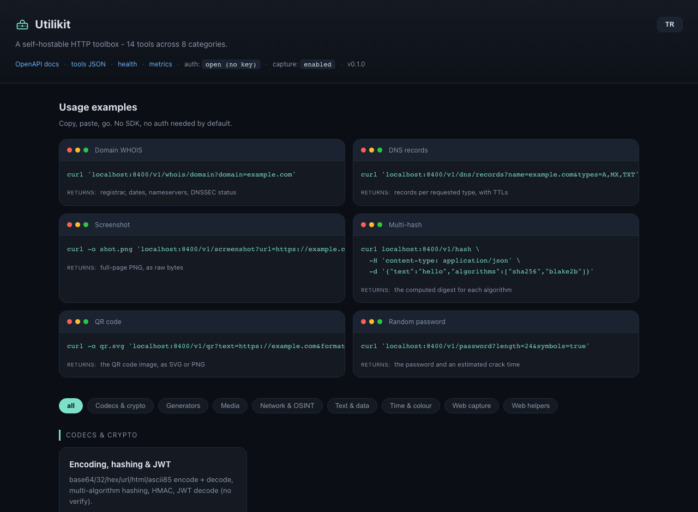

<p align="center"></p>
<h1 align="center">Utilikit</h1>

A self-hostable HTTP toolbox I put together for the third Raspberry Pi
sitting on my desk. One FastAPI service, around 45 small endpoints -
WHOIS/RDAP, DNS, TLS inspection, screenshots and PDFs of websites, page
unfurling, image transforms, hashing and encoding, QR codes, a request bin,
a URL shortener, and a handful of other things I kept wanting a quick API
for instead of reaching for yet another website.

*[Türkçe README için buraya bakabilirsin](README.tr.md).*



It runs comfortably on a Raspberry Pi 4 or whatever old laptop you've got
lying around, and it doesn't ask for any external accounts - the network
calls it makes on your behalf go to public, key-less endpoints (RDAP, public
DNS resolvers, and whatever site you point it at).

```bash
pip install utilikit
utilikit serve            # -> http://localhost:8400, with a live tool index at /
```

```console
$ curl 'localhost:8400/v1/whois/domain?domain=example.com'
$ curl 'localhost:8400/v1/dns/records?name=example.com&types=A,MX,TXT'
$ curl 'localhost:8400/v1/tls/cert?host=badssl.com'
$ curl 'localhost:8400/v1/hash' -H 'content-type: application/json' \
       -d '{"text":"hello","algorithms":["sha256","blake2b"]}'
$ curl -o shot.png 'localhost:8400/v1/screenshot?url=https://example.com&full_page=true'
```

Everything's browsable at `/`, Swagger docs at `/docs`, and there's a
machine-readable list at `GET /v1/tools` if you want to script against it. The
index page has a TR/EN toggle in the top corner, remembered per browser.

---

## What's actually in here

| Category | Endpoints |
|---|---|
| Network & OSINT | `whois/domain` (RDAP, falls back to port 43), `whois/ip`, `asn`, `ip/info` (RDAP + reverse DNS + ASN + optional geo), `dns/records`, `dns/reverse`, `dns/propagation` (checks 5 resolvers), `http/headers` (with a security-header audit), `http/redirects`, `tls/cert`, `net/tcp-ping`, `net/port-check` |
| Web capture | `screenshot` (viewport or full page, dark mode, sync or async), `pdf`, `render` (raw HTML to PNG/PDF) - needs the `browser` extra |
| Web helpers | `unfurl` (OG/Twitter/oEmbed/favicon/canonical), `readability`, `links`, `html2text`, `favicon`, `ua/parse`, `mime`, `luhn`, a request bin at `/bin/{id}`, a URL shortener at `/s/{code}` |
| Media | `image/transform`, `image/thumbnail`, `image/exif`, `image/strip-exif`, `image/palette`, `og-image` (a social card generator that doesn't need a browser), `qr` (PNG/SVG), `qr/decode` (needs the `decode` extra), `barcode` |
| Codecs & crypto | `encode`/`decode` (base64/32/hex/url/html/ascii85), `hash` (md5 through sha3/blake2/crc32), `hmac`, `jwt/decode` |
| Generators | `id/uuid` (v1/v4/v7), `id/ulid`, `id/nanoid`, `password`, `passphrase`, `password/strength` |
| Text & data | `slugify`, `case`, `lorem`, `diff`, `markdown`, `text/stats`, `regex/test`, `json/format`, `json/query` (JSONPath), `convert/yaml-json`, `convert/csv-json`, `base/convert` |
| Time & colour | `time/now`, `time/convert`, `cron/next`, `duration/humanize`, `color/convert`, `color/contrast` (WCAG), `color/palette` |

Full catalogue with examples: [`docs/TOOLS.md`](docs/TOOLS.md) ([Türkçe](docs/TOOLS.tr.md)).

---

## What it needs to run

| | Minimum | What I'd use |
|---|---|---|
| Board / PC | Raspberry Pi 3B, or basically any x86-64 box | Pi 4B 2 GB, or an old laptop |
| RAM | 512 MB for the core API | 2 GB if you want the browser too |
| Disk | 2 GB | 4 GB (Chromium alone is ~400 MB) |
| Python | 3.11+ | 3.12 |
| OS | any Linux or macOS; Raspberry Pi OS Bookworm works well | - |

A few things worth knowing:

- Everything except screenshots and PDFs is light - around 120–180 MB RSS.
- Screenshots and PDFs need Chromium through Playwright
  (`utilikit[browser]`). Each page context runs about 150–250 MB, so leave
  `UTILIKIT_BROWSER_CONCURRENCY=1` on a 2 GB Pi. You can turn capture off
  entirely with `UTILIKIT_BROWSER_ENABLED=false` if you don't need it.
- `qr/decode` wants `utilikit[decode]` plus the system `libzbar0` library.
- Geolocation in `ip/info` wants `utilikit[geo]` and a MaxMind/DB-IP `.mmdb`
  file you supply yourself - I'm not shipping one.

---

## Getting it running

### Docker - the easy way, includes the browser

```bash
docker run -p 8400:8400 -v utilikit-data:/data ghcr.io/gorkemguler/utilikit:latest
# or, from a clone:
docker compose up --build
```

### pip

```bash
python -m venv .venv && . .venv/bin/activate
pip install "utilikit[browser]"      # drop [browser] if you don't need screenshots
playwright install --with-deps chromium   # only if you kept [browser]
utilikit gen-key                     # optional, if you want an API key
utilikit serve
```

### As a permanent service on a Pi or an old PC

```bash
git clone https://github.com/gorkemguler/utilikit.git && cd utilikit
sudo deploy/scripts/install.sh          # sets up a venv, a systemd unit, /etc/utilikit/utilikit.env
sudo systemctl enable --now utilikit
```

More on systemd, Ansible, putting a reverse proxy in front of it, and
exposing it safely beyond your LAN: [`docs/DEPLOY.md`](docs/DEPLOY.md).

---

## Configuration

Environment variables prefixed `UTILIKIT_`, and a `.env` file gets picked up
automatically. The ones you're most likely to touch:

| Variable | Default | Notes |
|---|---|---|
| `UTILIKIT_HOST` / `UTILIKIT_PORT` | `0.0.0.0` / `8400` | where it binds |
| `UTILIKIT_API_KEYS` | empty = open | comma-separated, sent as `X-API-Key` |
| `UTILIKIT_RATE_LIMIT_PER_MIN` | `120` | per key, or per client IP if there's no key |
| `UTILIKIT_ALLOW_PRIVATE_FETCH` | `false` | leave this alone if you're exposing the instance - see below |
| `UTILIKIT_BROWSER_ENABLED` | `true` | flip to disable screenshot/pdf/render entirely |
| `UTILIKIT_BROWSER_CONCURRENCY` | `1` | how many Chromium contexts run at once (watch your RAM) |
| `UTILIKIT_FETCH_ALLOW_HOSTS` | empty | if set, only these host suffixes can be fetched at all |
| `UTILIKIT_PUBLIC_BASE_URL` | empty | used to build absolute shortener/bin links |

Everything else, with comments, is in [`.env.example`](.env.example).

---

## A note on exposing this to more than your LAN

A handful of these tools take a URL from whoever's calling and fetch it -
`screenshot`, `unfurl`, `http/headers`, and a few others. That's inherently
an SSRF risk if you open this up without thinking about it, so there's a
guard built in (`utilikit.safefetch`): only `http`/`https` is allowed, every
hostname gets resolved and checked, and private, loopback, link-local, and
cloud-metadata addresses are refused unless you explicitly turn that off
with `UTILIKIT_ALLOW_PRIVATE_FETCH=true`. Every redirect hop gets re-checked
too, and there are caps on body size and time.

If you're putting this somewhere other than your own network: set
`UTILIKIT_API_KEYS`, leave `ALLOW_PRIVATE_FETCH` false, put TLS in front of
it, and consider locking `UTILIKIT_FETCH_ALLOW_HOSTS` down to just the
domains you actually need.

---

## Running the tests

```bash
pip install -e ".[dev]"
ruff check . && ruff format --check .
pytest
```

Adding a new tool is one file - a router plus a registry entry - see
[`docs/ARCHITECTURE.md`](docs/ARCHITECTURE.md) if you want to add one.

## License

MIT - see [`LICENSE`](LICENSE).
