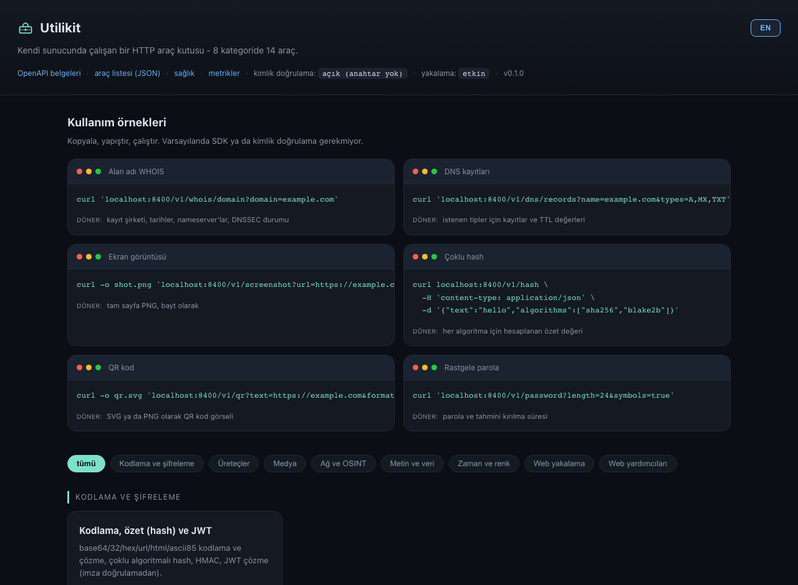

<p align="center"></p>
<h1 align="center">Utilikit</h1>

Masamdaki üçüncü Raspberry Pi için hazırladığım, kendi sunucunda çalışan bir
HTTP araç kutusu. Tek bir FastAPI servisi, yaklaşık 45 küçük endpoint -
WHOIS/RDAP, DNS, TLS incelemesi, web sitelerinin ekran görüntüsü ve PDF'i,
sayfa özet çıkarma, resim dönüştürme, hash ve encode işlemleri, QR kod,
bir request bin, bir URL kısaltıcı ve ayrıca her seferinde başka bir siteye
gitmek yerine hızlıca bir API'de bulunmasını istediğim birkaç şey daha.

*[English README is here](README.md).*



Not: canlı sayfanın sağ üstünde bir **TR/EN** düğmesi var, araç kutusu arayüzünü
Türkçe ya da İngilizce görebilirsin - tercih tarayıcında hatırlanır.

Bir Raspberry Pi 4'te ya da elindeki eski bir laptop'ta rahatça çalışır,
harici bir hesap da istemiyor - senin adına yaptığı ağ istekleri hep public,
anahtarsız endpoint'lere gidiyor (RDAP, public DNS sunucuları, sorduğun site
her neyse o).

```bash
pip install utilikit
utilikit serve            # -> http://localhost:8400, / altında canlı bir araç listesi var
```

```console
$ curl 'localhost:8400/v1/whois/domain?domain=example.com'
$ curl 'localhost:8400/v1/dns/records?name=example.com&types=A,MX,TXT'
$ curl 'localhost:8400/v1/tls/cert?host=badssl.com'
$ curl 'localhost:8400/v1/hash' -H 'content-type: application/json' \
       -d '{"text":"hello","algorithms":["sha256","blake2b"]}'
$ curl -o shot.png 'localhost:8400/v1/screenshot?url=https://example.com&full_page=true'
```

Her şey `/` altında tarayıcıdan görülebilir, Swagger dokümanı `/docs`'ta, ve
`GET /v1/tools` ile makine tarafından okunabilir bir liste de var, script
yazmak istersen.

---

## İçinde ne var

| Kategori | Endpoint'ler |
|---|---|
| Ağ & OSINT | `whois/domain` (RDAP, port 43'e düşer), `whois/ip`, `asn`, `ip/info` (RDAP + reverse DNS + ASN + opsiyonel konum), `dns/records`, `dns/reverse`, `dns/propagation` (5 resolver'ı kontrol eder), `http/headers` (güvenlik başlığı denetimiyle), `http/redirects`, `tls/cert`, `net/tcp-ping`, `net/port-check` |
| Web yakalama | `screenshot` (viewport ya da tam sayfa, dark mode, sync ya da async), `pdf`, `render` (ham HTML'den PNG/PDF) - `browser` ekstrası gerekir |
| Web yardımcıları | `unfurl` (OG/Twitter/oEmbed/favicon/canonical), `readability`, `links`, `html2text`, `favicon`, `ua/parse`, `mime`, `luhn`, `/bin/{id}` altında bir request bin, `/s/{code}` altında bir URL kısaltıcı |
| Medya | `image/transform`, `image/thumbnail`, `image/exif`, `image/strip-exif`, `image/palette`, `og-image` (tarayıcı gerektirmeyen sosyal kart üretici), `qr` (PNG/SVG), `qr/decode` (`decode` ekstrası gerekir), `barcode` |
| Kodlama & kripto | `encode`/`decode` (base64/32/hex/url/html/ascii85), `hash` (md5'ten sha3/blake2/crc32'ye), `hmac`, `jwt/decode` |
| Üreteçler | `id/uuid` (v1/v4/v7), `id/ulid`, `id/nanoid`, `password`, `passphrase`, `password/strength` |
| Metin & veri | `slugify`, `case`, `lorem`, `diff`, `markdown`, `text/stats`, `regex/test`, `json/format`, `json/query` (JSONPath), `convert/yaml-json`, `convert/csv-json`, `base/convert` |
| Zaman & renk | `time/now`, `time/convert`, `cron/next`, `duration/humanize`, `color/convert`, `color/contrast` (WCAG), `color/palette` |

Örnekleriyle tam katalog: [`docs/TOOLS.tr.md`](docs/TOOLS.tr.md) ([English](docs/TOOLS.md)).

---

## Çalışması için gerekenler

| | Asgari | Benim tercihim |
|---|---|---|
| Kart / PC | Raspberry Pi 3B, ya da hemen hemen her x86-64 kutu | Pi 4B 2 GB, ya da eski bir laptop |
| RAM | Çekirdek API için 512 MB | Tarayıcıyı da istiyorsan 2 GB |
| Disk | 2 GB | 4 GB (Chromium tek başına ~400 MB) |
| Python | 3.11+ | 3.12 |
| OS | herhangi bir Linux ya da macOS; Raspberry Pi OS Bookworm gayet iyi çalışıyor | - |

Bilmekte fayda var:

- Ekran görüntüsü ve PDF hariç her şey hafif - RSS olarak ~120–180 MB civarı.
- Ekran görüntüsü ve PDF için Playwright üzerinden Chromium gerekiyor
  (`utilikit[browser]`). Her sayfa bağlamı ~150–250 MB tutuyor, o yüzden 2
  GB'lık bir Pi'de `UTILIKIT_BROWSER_CONCURRENCY=1`'de bırak. İhtiyacın
  yoksa `UTILIKIT_BROWSER_ENABLED=false` ile tamamen kapatabilirsin.
- `qr/decode`, `utilikit[decode]` ve sistemdeki `libzbar0` kütüphanesini
  istiyor.
- `ip/info` içindeki konum bilgisi `utilikit[geo]` ve kendi sağladığın bir
  MaxMind/DB-IP `.mmdb` dosyası istiyor - ben bir tane dahil etmiyorum.

---

## Çalıştırma

### Docker - en kolay yol, tarayıcı dahil

```bash
docker run -p 8400:8400 -v utilikit-data:/data ghcr.io/gorkemguler/utilikit:latest
# ya da bir klondan:
docker compose up --build
```

### pip

```bash
python -m venv .venv && . .venv/bin/activate
pip install "utilikit[browser]"      # ekran görüntüsü istemiyorsan [browser]'ı çıkar
playwright install --with-deps chromium   # [browser]'ı tuttuysan
utilikit gen-key                     # istersen bir API anahtarı
utilikit serve
```

### Pi ya da eski bir PC'de kalıcı servis olarak

```bash
git clone https://github.com/gorkemguler/utilikit.git && cd utilikit
sudo deploy/scripts/install.sh          # venv, systemd unit, /etc/utilikit/utilikit.env kurar
sudo systemctl enable --now utilikit
```

systemd, Ansible, önüne reverse proxy koymak ve güvenli şekilde LAN dışına
açmak için: [`docs/DEPLOY.md`](docs/DEPLOY.md).

---

## Yapılandırma

`UTILIKIT_` önekli ortam değişkenleri, bir `.env` dosyası otomatik okunuyor.
En çok dokunacakların:

| Değişken | Varsayılan | Not |
|---|---|---|
| `UTILIKIT_HOST` / `UTILIKIT_PORT` | `0.0.0.0` / `8400` | nereye bağlanacağı |
| `UTILIKIT_API_KEYS` | boş = açık | virgülle ayrılmış, `X-API-Key` olarak gönderilir |
| `UTILIKIT_RATE_LIMIT_PER_MIN` | `120` | anahtar başına, yoksa client IP başına |
| `UTILIKIT_ALLOW_PRIVATE_FETCH` | `false` | dışarı açıyorsan buna dokunma - aşağıya bak |
| `UTILIKIT_BROWSER_ENABLED` | `true` | screenshot/pdf/render'ı tamamen kapatmak için kapat |
| `UTILIKIT_BROWSER_CONCURRENCY` | `1` | aynı anda kaç Chromium bağlamı çalışır (RAM'e dikkat) |
| `UTILIKIT_FETCH_ALLOW_HOSTS` | boş | doluysa sadece bu host'lar getirilebilir |
| `UTILIKIT_PUBLIC_BASE_URL` | boş | kısaltıcı/bin linklerini mutlak yapmak için |

Geri kalan her şey, açıklamalarıyla, [`.env.example`](.env.example) içinde.

---

## LAN dışına açarken dikkat edilecekler

Bu araçlardan birkaçı - `screenshot`, `unfurl`, `http/headers` ve birkaçı
daha - çağıranın verdiği bir URL'i alıp getiriyor. Bunu düşünmeden dışarı
açarsan doğası gereği bir SSRF riski oluyor, o yüzden içine bir koruma
koydum (`utilikit.safefetch`): sadece `http`/`https`'e izin veriliyor, her
hostname çözülüp kontrol ediliyor, private/loopback/link-local/cloud-metadata
adresleri `UTILIKIT_ALLOW_PRIVATE_FETCH=true` ile bilerek açmadığın sürece
reddediliyor. Her redirect adımı da yeniden kontrol ediliyor, gövde boyutu ve
süre için de sınırlar var.

Bunu kendi ağının dışına koyacaksan: `UTILIKIT_API_KEYS` ayarla,
`ALLOW_PRIVATE_FETCH`'i false bırak, önüne TLS koy, ve
`UTILIKIT_FETCH_ALLOW_HOSTS`'u gerçekten ihtiyacın olan domain'lerle
sınırlamayı düşün.

---

## Testleri çalıştırmak

```bash
pip install -e ".[dev]"
ruff check . && ruff format --check .
pytest
```

Yeni bir araç eklemek tek dosya - bir router ve bir registry kaydı - eklemek
istersen [`docs/ARCHITECTURE.md`](docs/ARCHITECTURE.md)'a bak.

## Lisans

MIT - bkz. [`LICENSE`](LICENSE).
